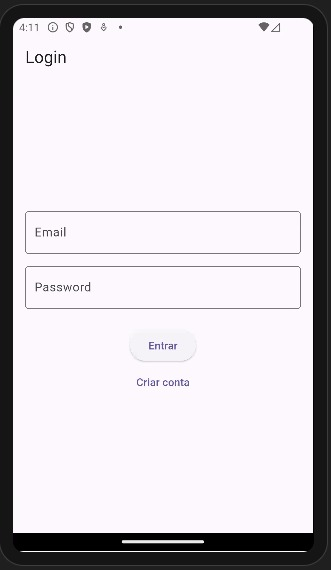
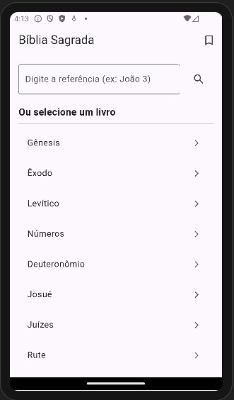
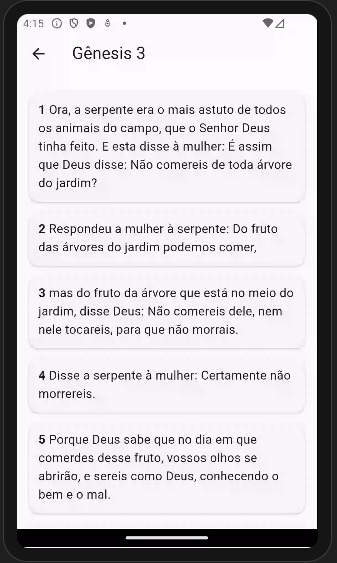
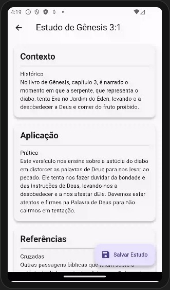
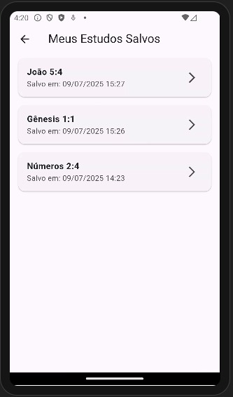

# 📖 Bíblia AI — Estudo Bíblico com Flutter, Firebase e OpenAI

Aplicativo de estudo bíblico que permite ao usuário explorar os textos sagrados, gerar interpretações com inteligência artificial (IA) e salvar os estudos na nuvem com segurança. Desenvolvido com Flutter (padrão MVC), Firebase e API da OpenAI.

---

## 🚀 Funcionalidades

- 🔐 **Autenticação** via e-mail e senha com Firebase Auth
- 📚 **Leitura bíblica** com navegação por livro e capítulo (API Bible)
- 🧠 **Geração de estudo por IA (GPT-3.5+)** ao tocar num versículo
- 💾 **Salvar estudos** com data e referência
- 🗂️ **Biblioteca de estudos salvos**, com acesso a cada item
- 🌐 **Abertura de links externos** via WebView (se houver)
- 🔒 **Regras de segurança no Firestore** para proteger os dados do usuário

---

## 🧱 Estrutura do Projeto (MVC)

lib/
├── controller/
├── model/
├── service/
├── view/
├── app_routes.dart
└── main.dart

---

## ⚙️ Tecnologias

- Flutter + Dart
- Firebase Auth
- Cloud Firestore
- OpenAI API (GPT-3.5+)
- Bible API
- WebView Flutter
- flutter_dotenv para chave segura

---

## 📁 Arquivo .env (exemplo)

OPENAI_API_KEY=sua_chave_openai_aqui

---

## ▶️ Como rodar o app localmente

- [git clone](https://github.com/marianabelegante/biblia.git)

- flutter pub get

Crie o arquivo .env na raiz:

- OPENAI_API_KEY=sua-chave-aqui

Execute com:

- flutter run

---

# 📲 Requisitos

- Android API 21 ou superior
- Firebase configurado
- Conexão com internet para IA e leitura bíblica

---

# 👩‍💻 Desenvolvido por

- Mariana Belegante

## 🖼️ Telas do App

### 🔐 Tela de Login

---

### 📚 Tela Inicial — Livros da Bíblia

---

### 📖 Capítulo com Versículos

---

### 🧠 Estudo Gerado com IA

---

### 💾 Biblioteca de Estudos Salvos

---